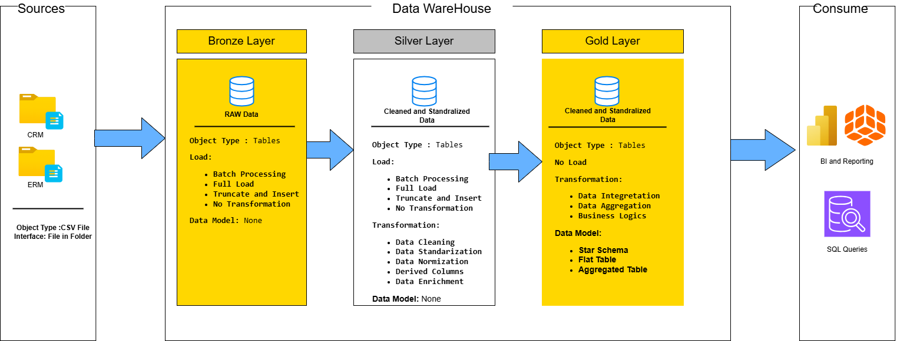
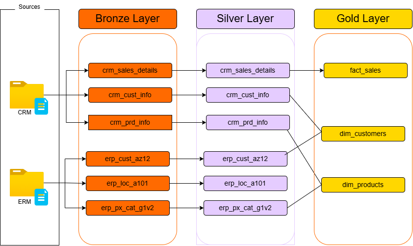
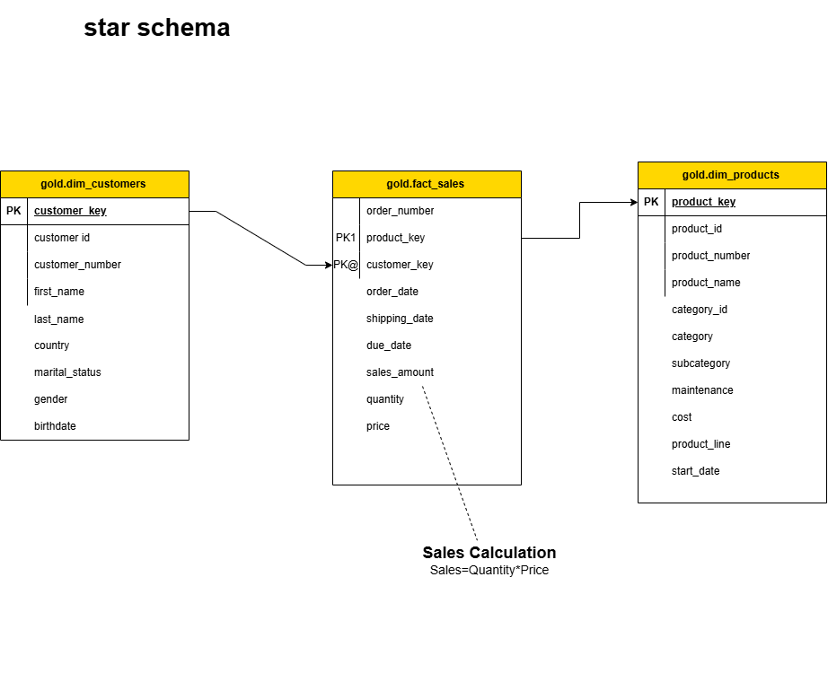

# Enterprise_Data_Warehouse

## Overview

This project demonstrates the design and implementation of a modern Data Warehouse using the Medallion Architecture approach (Bronze, Silver, and Gold layers). The warehouse integrates data from multiple source systems including CRM and ERP systems, processes the data through ETL pipelines, and creates analytical models for business intelligence and reporting.

The project focuses on:

* Data ingestion from CSV files
* Data cleaning and standardization
* ETL pipeline development using SQL
* Star schema modeling
* Fact and Dimension table creation
* Analytical querying and reporting

---

# Architecture

## Data Warehouse Architecture

The project follows a layered Medallion Architecture:

### Bronze Layer

* Stores raw data from source systems
* No transformations applied
* Full batch loading process
* Acts as the raw historical storage layer

### Silver Layer

* Performs data cleaning and transformation
* Standardizes inconsistent values
* Handles null values and formatting issues
* Creates derived and enriched datasets

### Gold Layer

* Creates business-ready analytical models
* Implements Star Schema design
* Contains Fact and Dimension tables
* Optimized for BI reporting and SQL analytics

---

## Architecture Diagram



---

## Data Flow Diagram



---

# Star Schema Design

The Gold Layer implements a Star Schema consisting of:

## Fact Table

### `gold.fact_sales`

Contains transactional sales data:

* Order Number
* Product Key
* Customer Key
* Order Date
* Shipping Date
* Due Date
* Sales Amount
* Quantity
* Price

## Dimension Tables

### `gold.dim_customers`

Contains customer-related attributes:

* Customer ID
* Customer Number
* First Name
* Last Name
* Country
* Marital Status
* Gender
* Birthdate

### `gold.dim_products`

Contains product-related attributes:

* Product ID
* Product Number
* Product Name
* Category
* Subcategory
* Product Line
* Maintenance
* Cost

---

## Star Schema Diagram



---

# Tech Stack

* SQL Server
* T-SQL
* Data Warehouse Concepts
* ETL Pipelines
* Star Schema Modeling
* Batch Processing
* CSV File Integration

---

# Source Systems

The warehouse integrates data from:

## CRM System

* Customer Information
* Product Information
* Sales Details

## ERP System

* Customer Demographics
* Product Categories
* Location Information

---

# Database Structure

## Schemas Used

### Bronze Schema

Stores raw ingested data.

Tables:

* bronze.crm_cust_info
* bronze.crm_prd_info
* bronze.crm_sales_details
* bronze.erp_cust_az12
* bronze.erp_loc_a101
* bronze.erp_px_cat_g1v2

### Silver Schema

Stores cleaned and transformed data.

Tables:

* silver.crm_cust_info
* silver.crm_prd_info
* silver.crm_sales_details
* silver.erp_cust_az12
* silver.erp_cust_a101
* silver.erp_px_cat_g1v2

### Gold Schema

Stores business-ready analytical models.

Views:

* gold.dim_customers
* gold.dim_products
* gold.fact_sales

---

# ETL Pipeline

## Step 1: Database and Schema Creation

Creates the database and Medallion Architecture schemas.

### Script:

* `warehouse and schema creation.sql`

---

## Step 2: Bronze Layer Table Creation

Creates raw ingestion tables.

### Script:

* `creating all tables.sql`

---

## Step 3: Bulk Data Loading

Loads CSV data into Bronze tables.

### Features:

* Batch Processing
* Full Load
* Truncate and Insert Strategy

### Script:

* `BULK INSERT DATA TO TABLES.sql`

---

## Step 4: Silver Layer Processing

Cleans and transforms the raw data.

### Transformations Performed

* Data Cleaning
* Trimming Spaces
* Null Handling
* Gender Standardization
* Country Standardization
* Date Validation
* Derived Columns
* Business Rule Application

### Scripts:

* `crateing silver layer tables.sql`
* `clean and load data to silver layer.sql`
* `clean and load data to silver.erp_cust_a101.sql`
* `clean and load data to silver.erp_px_cat_g1v2.sql`
* `clean and load silver.crm_sales_details.sql`
* `clean and load silver.erm_cust_az12.sql`
* `clear and load prd silver table.sql`

---

## Step 5: Gold Layer Modeling

Creates analytical models using Star Schema.

### Scripts:

* `creation of gold layer dimension customer table.sql`
* `creation of gold layer dimension product table.sql`
* `creation of gold layer fact sales table.sql`

---

# Data Transformation Examples

## Customer Data Cleaning

* Converted marital status codes:

  * M → Married
  * S → Single
* Standardized gender values:

  * M → Male
  * F → Female
* Removed unnecessary spaces using `TRIM()`

## Country Standardization

* US and USA → United States
* DE → Germany

## Date Validation

* Future birthdates converted to NULL

## Product Data Cleaning

* Historical product records filtered
* Active products retained using:

```sql
WHERE prd_end_dt IS NULL
```

---

# Analytical Queries

The project includes analytical SQL queries for reporting and business insights.

## Example: Monthly Sales Analysis

```sql
SELECT
    DATENAME(month, order_date) AS months,
    SUM(sales_amount) AS monthly_sales,
    COUNT(DISTINCT customer_key) AS total_customers
FROM gold.fact_sales
WHERE DATENAME(month, order_date) IS NOT NULL
GROUP BY DATENAME(month, order_date)
ORDER BY DATENAME(month, order_date) DESC;
```

### Script:

* `time series analysis.sql`

---

# Business Use Cases

This warehouse can support:

* Sales Analytics
* Customer Analytics
* Product Performance Analysis
* Revenue Reporting
* Monthly Trend Analysis
* BI Dashboards
* KPI Reporting
* Executive Reporting

---

# Key Features

* End-to-End Data Warehouse Implementation
* Medallion Architecture
* ETL Pipeline Development
* Data Cleaning and Transformation
* Star Schema Modeling
* Fact and Dimension Table Design
* SQL-Based Analytics
* Batch Processing Workflow
* Business-Ready Reporting Layer

---

# Project Workflow

```text
CSV Files
   ↓
Bronze Layer (Raw Data)
   ↓
Silver Layer (Cleaned & Standardized Data)
   ↓
Gold Layer (Business Models)
   ↓
BI Reporting & Analytics
```

---

# How to Run the Project

## Step 1

Create the database and schemas:

```sql
warehouse and schema creation.sql
```

## Step 2

Create Bronze tables:

```sql
creating all tables.sql
```

## Step 3

Load raw CSV data:

```sql
BULK INSERT DATA TO TABLES.sql
```

## Step 4

Create and load Silver tables:

```sql
crateing silver layer tables.sql
```

Run all cleaning and transformation scripts.

## Step 5

Create Gold layer views:

```sql
creation of gold layer dimension customer table.sql
creation of gold layer dimension product table.sql
creation of gold layer fact sales table.sql
```

## Step 6

Run analytical queries:

```sql
time series analysis.sql
```

---

# Learning Outcomes

Through this project, the following concepts were implemented and practiced:

* Data Warehouse Design
* ETL Development
* SQL Transformations
* Medallion Architecture
* Star Schema Modeling
* Fact and Dimension Design
* Data Cleaning Techniques
* Analytical Query Writing
* Batch Processing Pipelines

---

# Future Enhancements

* Add Incremental Loading
* Implement Slowly Changing Dimensions (SCD)
* Add Data Quality Monitoring
* Integrate Power BI Dashboards
* Automate ETL Pipelines
* Add Logging and Error Handling
* Deploy to Cloud Platforms
* Add Scheduling with SQL Server Agent

---

# Author

## Aditya Shrivastav

Data Analytics & Data Engineering Enthusiast

Skills:

* SQL
* Data Warehousing
* ETL Pipelines
* Data Analytics
* Database Design
* BI Reporting

---

# Conclusion

This project demonstrates the complete lifecycle of building a modern Data Warehouse system using SQL Server and Medallion Architecture principles. It includes raw data ingestion, transformation pipelines, star schema modeling, and analytical querying for business intelligence use cases.
